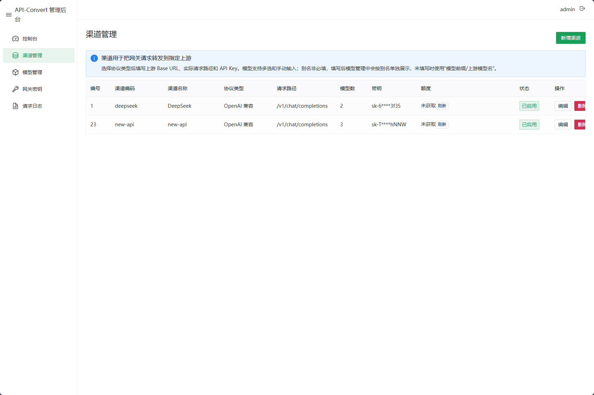
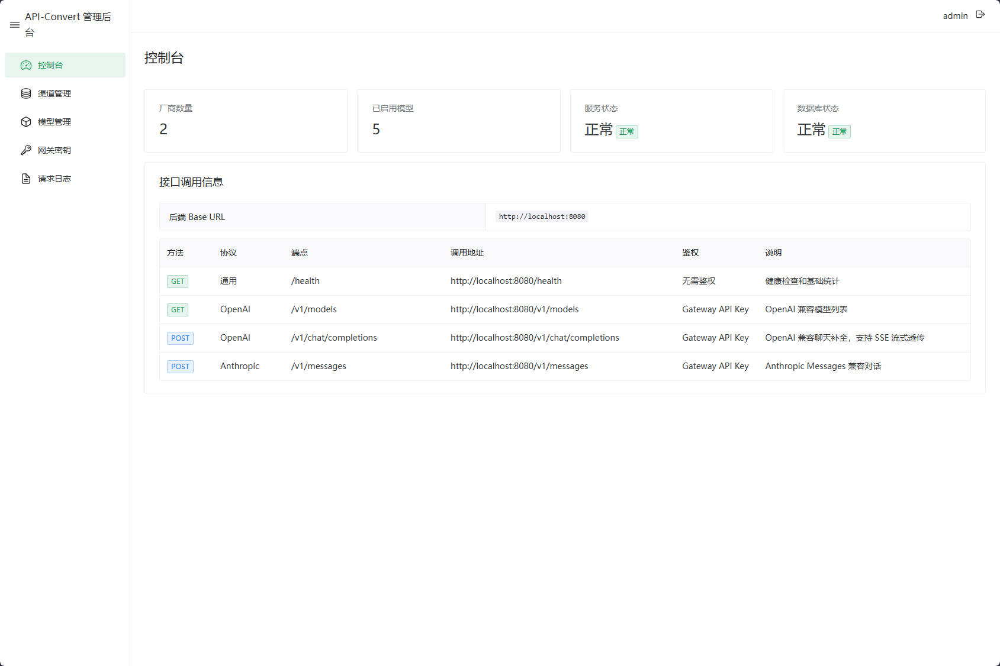
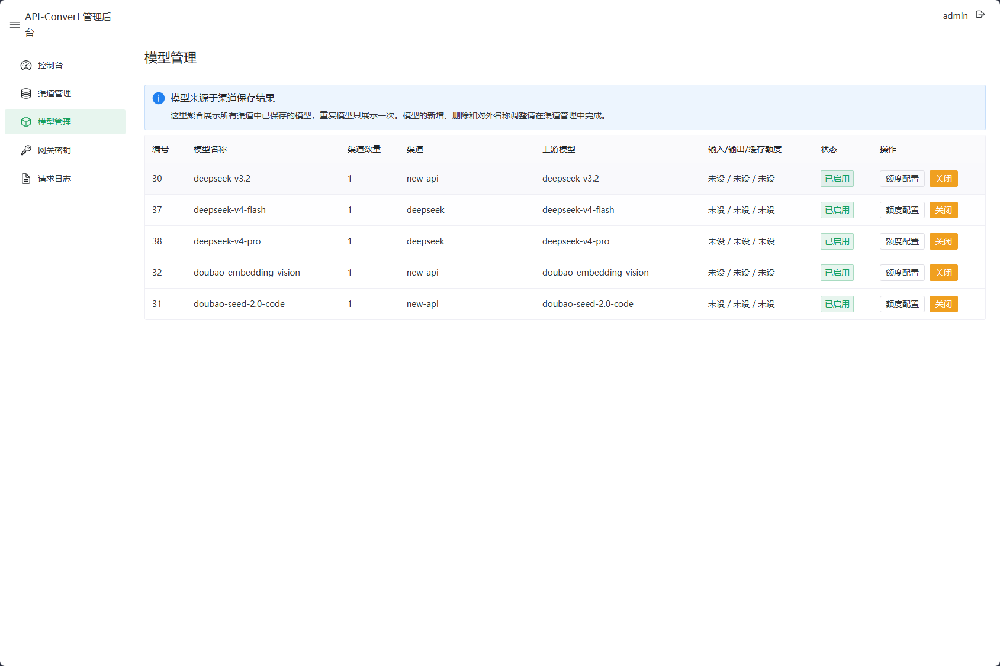
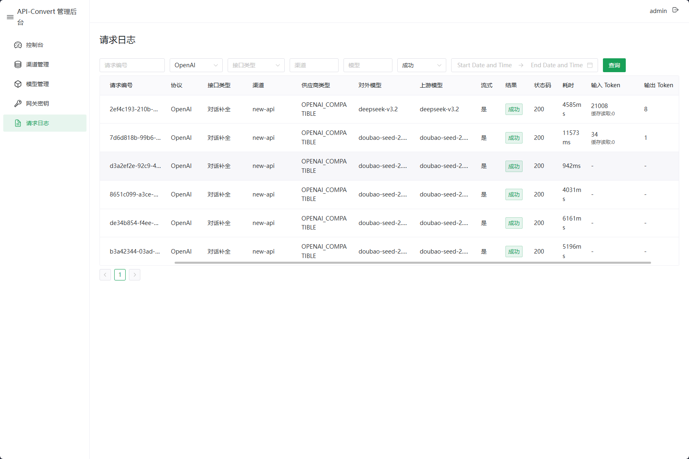
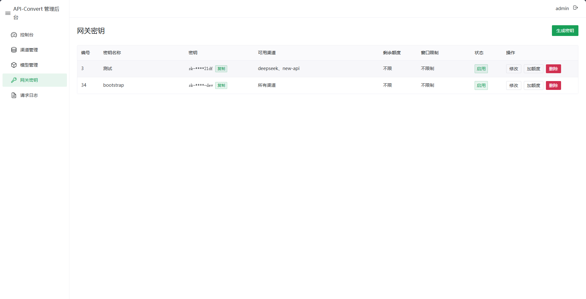

# api-convert

`api-convert` 是一个 Java 25 + Spring Boot 4 的 AI API 网关，提供 OpenAI / Anthropic 兼容入口，并通过管理端维护上游渠道、模型映射、网关 API Key 和请求日志。

## 界面预览











## 技术栈

- 后端：Java 25、Spring Boot 4.0.6、Maven、MyBatis-Plus、Log4j2
- 数据库：默认 SQLite，可通过环境变量切换 MySQL
- 前端：Vue 3、Vite、TypeScript、Naive UI

## 本地启动

前置要求：

- JDK 25
- Node.js 与 npm
- Maven Wrapper 使用仓库内的 `mvnw.cmd` / `mvnw`

Windows PowerShell：

```powershell
.\scripts\start.ps1
```

指定 JDK 25 路径：

```powershell
.\scripts\start.ps1 -JavaHome 'D:\path\to\jdk-25'
```

启动后端时会检查 `JAVA_OPTS`，如果未开启紧凑对象头，会自动追加：

```text
-XX:+UnlockExperimentalVMOptions -XX:+UseCompactObjectHeaders
```

指定管理端账号密码：

```powershell
.\scripts\start.ps1 -AdminUsername admin -AdminPassword 'change-me'
```

使用 MySQL 启动：

```powershell
.\scripts\start.ps1 -DbType mysql `
  -DatasourceUrl 'jdbc:mysql://127.0.0.1:3306/api_convert?useUnicode=true&characterEncoding=utf8&serverTimezone=Asia/Shanghai' `
  -DatasourceUsername api_convert `
  -DatasourcePassword 'change-me'
```

Linux / macOS / Git Bash：

```bash
./scripts/start.sh
```

指定 JDK 25 路径：

```bash
./scripts/start.sh --java-home /path/to/jdk-25
```

启动后端时会检查 `JAVA_OPTS`，如果未开启紧凑对象头，会自动追加：

```text
-XX:+UnlockExperimentalVMOptions -XX:+UseCompactObjectHeaders
```

指定管理端账号密码：

```bash
./scripts/start.sh --admin-username admin --admin-password 'change-me'
```

使用 MySQL 启动：

```bash
./scripts/start.sh --db-type mysql \
  --datasource-url 'jdbc:mysql://127.0.0.1:3306/api_convert?useUnicode=true&characterEncoding=utf8&serverTimezone=Asia/Shanghai' \
  --datasource-username api_convert \
  --datasource-password 'change-me'
```

默认会同时启动：

- 后端：http://localhost:8080
- 管理端前端：http://localhost:5173

也可以只启动其中一个：

```powershell
.\scripts\start.ps1 -Target backend
.\scripts\start.ps1 -Target frontend
```

```bash
./scripts/start.sh backend
./scripts/start.sh frontend
```

管理端默认账号来自环境变量，未设置时为：

- 用户名：`admin`
- 密码：`admin123`

## 常用接口

健康检查无需鉴权：

```bash
curl http://localhost:8080/health
```

网关 API Key 需要在管理端创建，创建后可用于访问 OpenAI / Anthropic 兼容接口：

```bash
curl -H "Authorization: Bearer <gateway-api-key>" http://localhost:8080/v1/models
```

```bash
curl -X POST http://localhost:8080/v1/chat/completions \
  -H "Authorization: Bearer <gateway-api-key>" \
  -H "Content-Type: application/json" \
  -d '{"model":"example-chat","messages":[{"role":"user","content":"hello"}],"stream":false}'
```

Anthropic Messages 入口：

```bash
curl -X POST http://localhost:8080/v1/messages \
  -H "Authorization: Bearer <gateway-api-key>" \
  -H "Content-Type: application/json" \
  -H "anthropic-version: 2023-06-01" \
  -d '{"model":"example-chat","messages":[{"role":"user","content":"hello"}],"stream":false}'
```

OpenAI Responses API 入口：

```bash
curl -X POST http://localhost:8080/v1/responses \
  -H "Authorization: Bearer <gateway-api-key>" \
  -H "Content-Type: application/json" \
  -d '{"model":"example-chat","input":"hello","stream":false}'
```

## 管理端配置流程

1. 访问 `http://localhost:8080`，使用管理端账号登录。
2. 在“渠道管理”中新增上游渠道，填写供应商类型、Base URL、请求路径、API Key，并选择或手动录入上游模型。
3. 在“模型管理”中按需调整对外模型的额度单价、能力标记和启用状态。
4. 在“网关密钥”中创建调用方密钥，并按需限制可用渠道或配置额度。
5. 在“系统配置”中调整路由模式、失败避让和会话粘性参数。
6. 在“控制台”查看按天、按小时以及按模型、渠道、密钥划分的 token 消耗趋势和分布。
7. 在“请求日志”按请求维度排查调用结果、调用密钥、上游渠道、token 用量和错误信息。

## 控制台仪表盘

控制台首页会展示健康状态、网关基础信息、公开端点和 token 使用统计。统计数据来自请求日志，支持按天、按小时查看总 token、输入 token、输出 token 和缓存读取 token，并按模型、渠道、网关密钥名称生成折线图和饼图。按天 token 图支持鼠标悬停查看当天各模型消耗。

管理端统计接口：

```bash
curl -H "Authorization: Bearer <admin-token>" \
  "http://localhost:8080/api/admin/dashboard/stats?days=7&hours=24&topN=6"
```

## 路由策略与失败避让

当同一个对外模型配置了多个可用渠道时，网关会按“系统配置”中的路由模式选择渠道。

| 路由模式 | 说明 | 适用场景 |
|---|---|---|
| `RANDOM` | 从可用渠道中随机选择，保持历史默认行为 | 简单分流 |
| `ROUND_ROBIN` | 按稳定渠道顺序轮询 | 均匀分配请求数 |
| `WEIGHTED` | 使用渠道管理里的“路由权重”做平滑加权轮询，权重越高流量越多 | 按供应商容量分配流量 |
| `SESSION_STICKY` | 同一网关密钥 + 模型 + 会话标识优先复用首次命中的渠道 | 提高上游缓存命中率 |

会话粘性会从请求头和协议参数中提取稳定标识，例如：

- 请求头：`session_id`、`thread_id`、`x-client-request-id`、`x-codex-window-id`
- 请求参数：`prompt_cache_key`、`previous_response_id`、`session_id`、`thread_id`、`conversation_id`
- Responses API `client_metadata` 中的 `session_id`、`thread_id`、`conversation_id`

失败避让按“网关密钥 + 渠道 + 上游模型”累计真实上游错误。额度不足、模型不存在、参数错误等网关本地拒绝不会计入失败。达到失败阈值后，该密钥会在配置的冷却时间内避让该渠道模型，并尝试切换到其他可用渠道；上游成功会清除对应失败状态。

系统配置接口：

管理端接口使用登录 token，不使用网关 API Key。先登录获取 `data.token`：

```bash
curl -X POST http://localhost:8080/api/admin/login \
  -H "Content-Type: application/json" \
  -d '{"username":"admin","password":"change-me"}'
```

```bash
curl -H "Authorization: Bearer <admin-token>" \
  http://localhost:8080/api/admin/system-config/routing
```

```bash
curl -X PUT http://localhost:8080/api/admin/system-config/routing \
  -H "Authorization: Bearer <admin-token>" \
  -H "Content-Type: application/json" \
  -d '{
    "mode": "SESSION_STICKY",
    "failureThreshold": 2,
    "failureCooldownMinutes": 10,
    "stickyTtlMinutes": 1440
  }'
```

说明：

- `failureThreshold` 或 `failureCooldownMinutes` 为 `0` 时关闭失败避让。
- `stickyTtlMinutes` 控制会话粘性绑定保留时间，最小值为 `1`。
- 系统配置保存在数据库 `gateway_system_config` 表中，重启后仍然生效。

## 重要配置

| 环境变量 | 默认值 | 说明 |
|---|---|---|
| `SERVER_PORT` | `8080` | 后端监听端口 |
| `API_CONVERT_TIME_ZONE` | `Asia/Shanghai` | 应用时区 |
| `API_CONVERT_DB_TYPE` | `sqlite` | 数据库类型：`sqlite` 或 `mysql` |
| `API_CONVERT_SQLITE_PATH` | `${user.dir}/api-convert.db` | SQLite 文件路径 |
| `SPRING_DATASOURCE_URL` | `jdbc:sqlite:${api-convert.database.sqlite-path}` | JDBC URL |
| `SPRING_DATASOURCE_USERNAME` | 空 | 数据库用户名 |
| `SPRING_DATASOURCE_PASSWORD` | 空 | 数据库密码 |
| `API_CONVERT_DB_INSTALL_ENABLED` | `true` | 是否启动时自动安装/升级表结构 |
| `API_CONVERT_SECURITY_ENABLED` | `true` | 是否启用网关 API Key 鉴权 |
| `API_CONVERT_ADMIN_USERNAME` | `admin` | 管理端账号 |
| `API_CONVERT_ADMIN_PASSWORD` | `admin123` | 管理端密码 |
| `LOG_PATH` | `logs` | 日志输出目录 |
| `LOG_LEVEL` / `APP_LOG_LEVEL` | 见 Log4j2 配置 | 日志级别 |
| `SQL_LOG_LEVEL` / `SQL_PARAM_LOG_LEVEL` | 见 Log4j2 配置 | SQL 日志级别 |

生产环境不要使用默认管理端密码。

MySQL JDBC URL 样例：

```text
jdbc:mysql://127.0.0.1:3306/api_convert?useUnicode=true&characterEncoding=utf8&serverTimezone=Asia/Shanghai
```

驱动类不需要单独传参，配置文件会按 `API_CONVERT_DB_TYPE` 固定选择：

- `sqlite`：`org.sqlite.JDBC`
- `mysql`：`com.mysql.cj.jdbc.Driver`

## Docker

构建镜像：

```bash
docker build -t api-convert:local .
```

发布镜像地址：

```text
crpi-vqmjtaxg5bb83uba.cn-guangzhou.personal.cr.aliyuncs.com/aping/api-convert:{版本号}
```

例如发布 `v1.0.2` 时：

```bash
docker pull crpi-vqmjtaxg5bb83uba.cn-guangzhou.personal.cr.aliyuncs.com/aping/api-convert:v1.0.2
```

直接使用发布镜像部署：

```bash
docker run -d --name api-convert \
  -p 8080:8080 \
  -v api-convert-data:/app/data \
  -e JAVA_OPTS='-XX:+UnlockExperimentalVMOptions -XX:+UseCompactObjectHeaders' \
  -e LOG_PATH=/app/data/logs \
  -e API_CONVERT_ADMIN_USERNAME=admin \
  -e API_CONVERT_ADMIN_PASSWORD='change-me' \
  crpi-vqmjtaxg5bb83uba.cn-guangzhou.personal.cr.aliyuncs.com/aping/api-convert:v1.0.2
```

使用 SQLite 运行：

```bash
docker run --rm -p 8080:8080 \
  -v api-convert-data:/app/data \
  -e JAVA_OPTS='-XX:+UnlockExperimentalVMOptions -XX:+UseCompactObjectHeaders' \
  -e LOG_PATH=/app/data/logs \
  -e API_CONVERT_ADMIN_USERNAME=admin \
  -e API_CONVERT_ADMIN_PASSWORD='change-me' \
  api-convert:local
```

容器内默认 SQLite 路径为 `/app/data/api-convert.db`，日志输出目录为 `/app/data/logs`。上例通过 `JAVA_OPTS` 开启 JDK 25 紧凑对象头，并将数据和日志统一映射到 `api-convert-data` volume。镜像构建时会编译前端并放入后端静态资源，启动后可直接访问 `http://localhost:8080` 使用管理端。

使用 MySQL 运行时示例：

```bash
docker run --rm -p 8080:8080 \
  -v api-convert-data:/app/data \
  -e JAVA_OPTS='-XX:+UnlockExperimentalVMOptions -XX:+UseCompactObjectHeaders' \
  -e LOG_PATH=/app/data/logs \
  -e API_CONVERT_DB_TYPE=mysql \
  -e SPRING_DATASOURCE_URL='jdbc:mysql://mysql:3306/api_convert?useUnicode=true&characterEncoding=utf8&serverTimezone=Asia/Shanghai' \
  -e SPRING_DATASOURCE_USERNAME=api_convert \
  -e SPRING_DATASOURCE_PASSWORD='change-me' \
  -e API_CONVERT_ADMIN_PASSWORD='change-me' \
  api-convert:local
```

## 构建与测试

后端：

```bash
mvn -q test
```

前端：

```bash
cd frontend
npm install
npm run build
```

## 开源协议

本项目使用 MIT License。该协议允许商用、修改、分发和私有使用，同时软件按“原样”提供，不提供任何形式的担保，作者和版权持有人不承担使用软件产生的责任。
